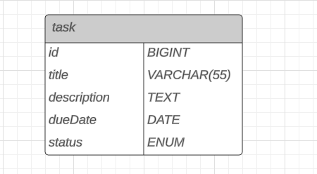

# Gerenciador de Tarefas Waterfy

Este é um projeto de demonstração utilizando Spring Boot. O projeto inclui uma API para gerenciar tarefas.

## Configuração

### Pré-requisitos

- [Java 21](https://www.oracle.com/br/java/technologies/downloads/#jdk21-windows)
- [Maven 3.9.4](https://maven.apache.org/download.cgi)
- [Docker](https://www.docker.com/products/docker-desktop/)

### Passos para configurar o projeto

1. Clone o repositório:

   ```sh
   git clone https://github.com/YuriPiresG/waterfyProject.git
   cd waterfyProject
   ```

2. Configure o banco de dados PostgreSQL utilizando Docker:

   ```sh
   docker-compose up -d
   ```

3. Instale as dependências do projeto:
   ```sh
   mvn clean install
   ```

## Executando o Projeto

1. Execute a aplicação:

   ```sh
   mvn spring-boot:run
   ```

2. A aplicação estará disponível em `http://localhost:8080/tasks`.

3. O Swagger estará disponível em `http://localhost:8080/swagger-ui/index.html#/`.

## Estrutura do Projeto

- `src/main/java/com/waterfy/projeto`: Contém o código fonte principal da aplicação.
  - `ProjetoApplication.java`: Classe principal que inicia a aplicação Spring Boot.
  - `tasks/`: Pacote que contém as classes relacionadas às tarefas.
    - `Task.java`: Entidade que representa uma tarefa.
    - `TasksController.java`: Controlador REST para gerenciar as tarefas.
    - `TasksRepository.java`: Repositório JPA para acessar os dados das tarefas.
    - `TasksServices.java`: Serviço que contém a lógica de negócio para as tarefas.
- `src/main/resources`: Contém os recursos da aplicação.
  - `application.properties`: Arquivo de configuração da aplicação.
- `src/test/java/com/waterfy/projeto`: Contém os testes da aplicação.
  - `ProjetoApplicationTests.java`: Classe de teste para verificar se o contexto da aplicação carrega corretamente.

## Decisões Técnicas

- **Spring Boot**: Utilizado para simplificar a configuração e o desenvolvimento da aplicação.
- **Spring Data JPA**: Utilizado para facilitar o acesso aos dados no banco de dados PostgreSQL.
- **Lombok**: Utilizado para reduzir o código boilerplate, como getters, setters e construtores.
- **Docker Compose**: Utilizado para configurar e executar o banco de dados PostgreSQL de forma simples.
- **Validação**: Utilizado `jakarta.validation` para validar os campos das entidades.

### DER do Banco de Dados



## Endpoints da API

- `GET /tasks`: Retorna todas as tarefas.
- `GET /tasks/{id}`: Retorna uma tarefa específica pelo ID.
- `GET /tasks/uncompleted`: Retorna todas as tarefas não concluídas.
- `POST /tasks`: Cria uma nova tarefa.
- `PUT /tasks/{id}`: Atualiza uma tarefa específica pelo ID.
- `DELETE /tasks/{id}`: Deleta uma tarefa específica pelo ID.
- `DELETE /tasks/completed`: Deleta todas as tarefas concluídas.
